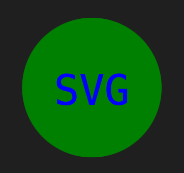
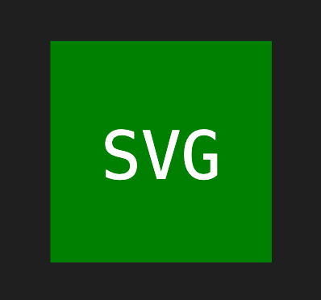
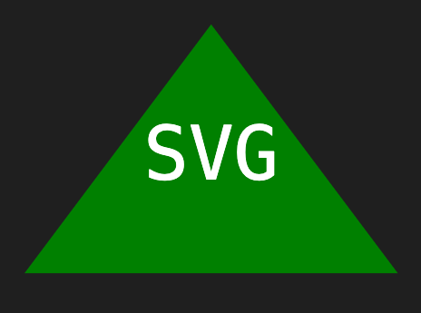
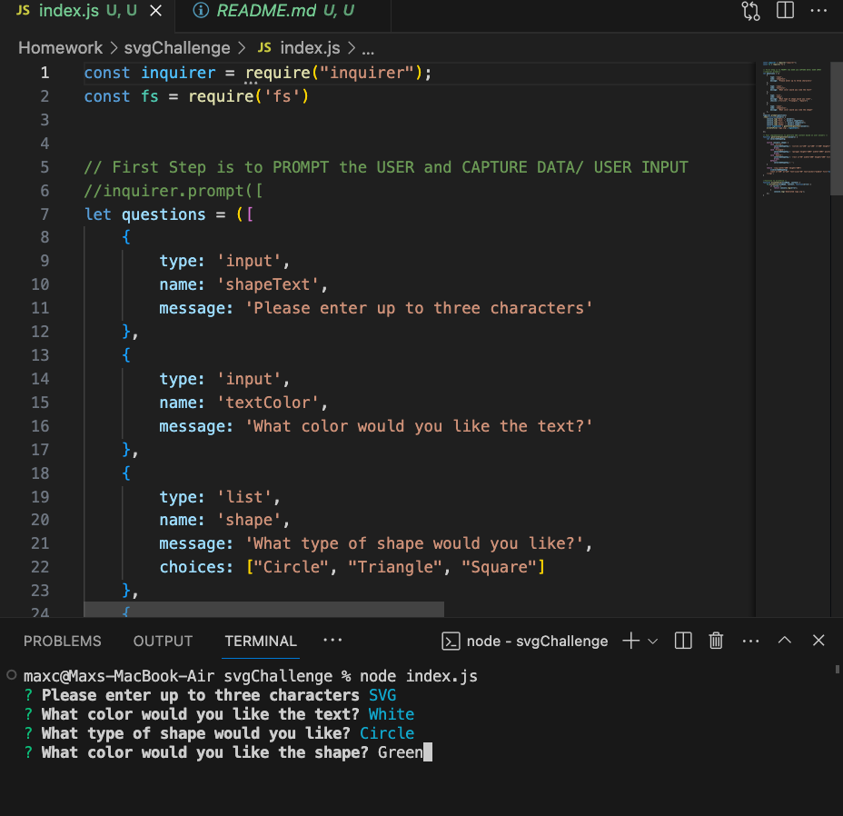
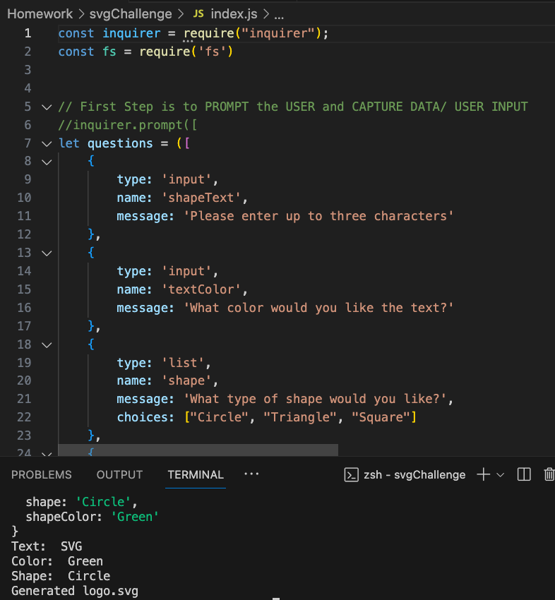
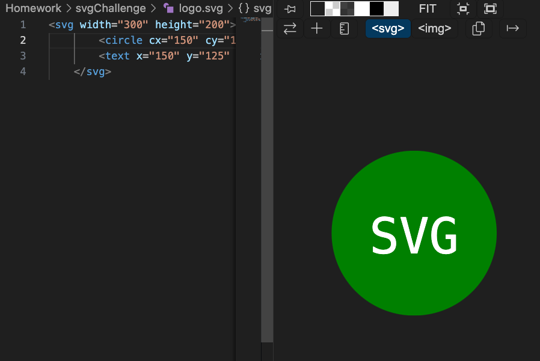

## SVG Project

This project is a demonstration on how to use svg and javascript files to create SVG files using javascript.

## Description

This application assists with logo creation for web developers, using Inquirer to gather user preferences via the command line: text (up to 3 characters), text color, shape (circle, square, or triangle), and shape color. It generates an SVG logo based on these choices, empowering web designers to create dynamic sites.
This project underscores the capabilities of back-end developers even without a graphical interface, while highlighting the importance of unit testing in collaborative projects.

### Dependencies

*node.js
*Inquirerv8.2.4
*Jest v29.7.0
*VS code

### Installing

1. Open in VS Code. If you do not have VS code you must install it.

2. Using the terminal, install node.js.

3. Once node.js is installed, in the terminal, utilize the command npm init -y to initialize and create a package.json where project files will be stored.

4. Next, use the terminal to run the command npm i to install the dependencies associated with this app. Need to install inquirer and jest directly from the command line, to do so the command for inquirer will be npm i inquirer@8.2.4, and npm i jest to install the latest version of jest.

5. Must answer prompted questions one by one and press enter button after each answered question.

6. To run the application, within the terminal, type the command 
node index.js.

### Usage

To run this application, use the command line to navigate to the directory of the application, install all dependencies (npm i), then type the command node index.js. You will then be taken through a series of questions. Once all questions have been answered properly, a message will display to the command line telling you your logo has been generated. Find your new logo in the newly generated SVG file.

## Tests

To run unit testing, open the terminal, and use the command npm run test.
Using Jest after being downloaded and dependencies are installed, run the test file with the corresponding SVG file with given choices.

## Links

Repo: https://github.com/Maxxxc1/svgChallenge
Video: https://youtu.be/EpVY_nnKRCk

## Screenshots

## Versions

"inquirer": "^8.2.6",
    "jest": "^29.7.0"

## License

This project is licensed under the [MIT] License

## Credits

Tutorx2
Youtube
mdn Web Docs
W#schools
gitlab Resources